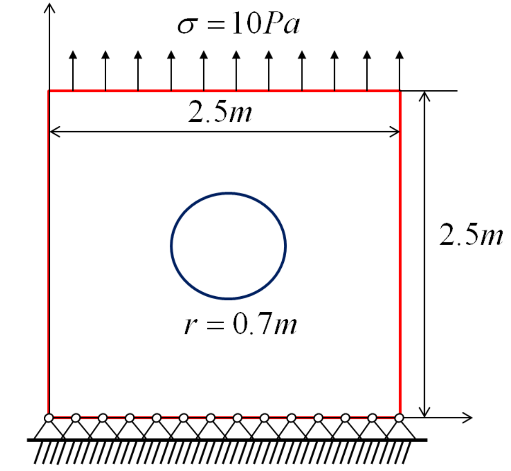

# VCFEM
Voronoi Cell Finite Element Method

In this repo I implemented Voronoi Cell Finite Element Method(VCFEM). I tested a single example of a 2D problem. The problem is a single inclusion model. Consider a unit thickness plate containing a single circular inclusion. The geometric dimensions, loads, and boundary conditions are shown. Substrate: $$E=1000Pa$$ , $$\nu=0.2$$ Inclusion: $$E=3000Pa$$ , $$\nu=0.2$$ 